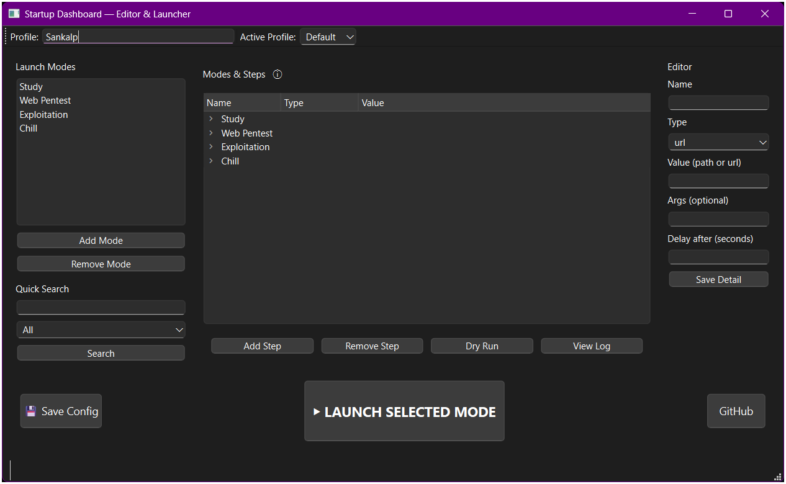

# 🚀 Startup Dashboard — Smart Multi-Mode Launcher

A modern **startup automation dashboard** built in **Python (PySide6)** that lets you instantly switch between customized workflows — like study, lab practice, exploitation, or chill modes — each launching specific apps, URLs, or tools automatically.

> 🎓 Created by **Sankalp Bhosale** (MCA Cyber Security & Forensics)

---

## 🌟 Overview

Tired of manually opening the same apps every time you start your PC?  
**Startup Dashboard** is your personal automation launcher for Windows that shows a beautiful GUI at startup, allowing you to pick what you want to do — and it does the rest automatically.

Whether you’re studying, doing lab pentesting, working on TryHackMe, or just chilling — it launches everything you need with one click.

---

## 🖼️ Screenshot



*(Add your screenshot here — rename your image to `dashboard_screenshot.png` and place it in an `assets` folder in the repo.)*

---

## ⚙️ Key Features

### 🧭 Smart Modes
- **Study** – Open ChatGPT, YouTube, and study resources automatically.  
- **Web Pentest** – Launch Burp Suite, PortSwigger Labs, and OneNote for notes.  
- **Exploitation** – Open TryHackMe, VirtualBox, and other practice tools.  
- **Chill** – Fire up your favorite music or YouTube playlists.

### 🧩 Editable GUI
- Create, edit, or delete **modes** and **steps** directly from the app.  
- Supports both **apps** (`.exe`, `.vbs`, `.lnk`) and **URLs**.  
- Editable profile name and multiple configuration profiles.  
- Config is stored as a clean `.json` in your user folder.

### 🕒 Auto Startup Integration
- Automatically launches at Windows startup with a delay for stability.  
- No admin rights required — uses `pythonw.exe` silently (no console).  
- Auto-closes if no user interaction within 90 seconds.

### 💾 Configurable Editor
- Inline step editor: name, type, path/URL, args, delay.  
- One-click Save Config & Dry-Run preview mode.  
- Built-in log viewer for debugging your setups.

### 🎨 Modern Dark UI
- Built using **PySide6 (Qt for Python)**.  
- Custom layout with centered launch button and responsive resizing.  
- Supports keyboard shortcuts (`Ctrl+1..4`) for quick launches.

### ☕ Lightweight
- No background service or bloat.  
- Portable — works from any folder.

---

## 🧰 Tech Stack

- **Python 3.13+**
- **PySide6 (Qt Widgets GUI)**
- Standard libraries: `json`, `subprocess`, `webbrowser`, `os`, `time`, etc.

---

## 🧠 Installation & Setup

### 1️⃣ Clone this repository
```bash
git clone https://github.com/sankalpvb/startup-dashboard.git
cd startup-dashboard


### 2️⃣ Install dependencies

```bash
pip install PySide6
```

### 3️⃣ Run manually

```bash
python final2.py
```

### 4️⃣ (Optional) Build into an EXE

```bash
pip install pyinstaller
pyinstaller --onefile --noconsole --name startup_dashboard final2.py
```

After build, the `.exe` will be located in the `dist` folder.

### 5️⃣ Auto-run at Windows Startup

To start automatically at login:

1. Press `Win + R`, type `shell:startup` → press Enter.
2. Create a new file `StartupDashboardLauncher.cmd` with this content:

   ```cmd
   @echo off
   timeout /t 30 /nobreak >nul
   start "" "C:\Users\Sankalp\AppData\Local\Programs\Python\Python313\pythonw.exe" "C:\Users\Sankalp\startup_dashboard\final2.py"
   ```
3. Save → Done ✅
   It will run automatically at every login with a 30-second delay.

---

## 📁 Config File

All settings are saved in:

```
C:\Users\<YourUser>\.startup_dashboard_config.json
```

You can export or edit this JSON manually for advanced customization.

---

## 🧑‍💻 Developer Notes

* Uses threads for safe asynchronous app launching.
* Non-daemon workers ensure all apps launch completely before closing.
* Built-in inactivity timer closes the dashboard automatically.
* Supports multiple profiles and reusable mode definitions.

---

## 💡 Future Roadmap

* 🔒 Config encryption (optional master password)
* 🌗 Dark/Light theme toggle
* 🧩 Plugin mode packs
* 🛠️ Import/export profiles
* 🕹️ System tray quick-launch menu

---

## 🧾 License

MIT License © 2025 [Sankalp Bhosale](https://github.com/sankalpvb)

---

## 🌍 Connect

[](https://github.com/sankalpvb)

---

> *“Automation isn’t about being lazy — it’s about freeing your focus for what truly matters.”*

```

---

### 🔧 Instructions for you
1. Create a folder `assets/` in your project.
2. Save your screenshot as `assets/dashboard_screenshot.png`.
3. Create a new file in your project folder named `README.md`.
4. Copy and paste everything above into it.
5. Push it to your GitHub repository.

---

Would you like me to design a **simple logo/icon (PNG + ICO)** for your GitHub and EXE build (like a tech-themed “S” or a dashboard symbol)? I can generate that next.
```
